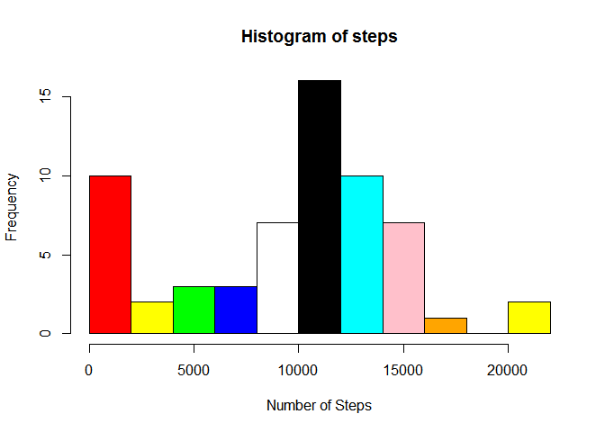
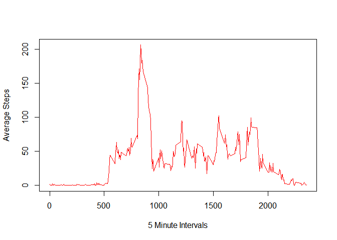

# Reproducible Research: Peer Assessment 1


## Loading and preprocessing the data


```r
activityData <- read.csv("C:/Users/SuitGeek/Desktop/RepData_PeerAssessment1/activity/activity.csv")
dateDownloaded <- date()
dateDownloaded
```

```
## [1] "Sun Jan 18 16:48:21 2015"
```


## What is mean total number of steps taken per day?


```r
activitySteps <- activityData$steps
medianSteps <- median(activitySteps,na.rm="TRUE")
averageSteps <- mean(activitySteps,na.rm="TRUE")
colors = c("red","yellow","green","blue","white","black","cyan","pink","orange")
steps <- tapply(activitySteps,activityData$date,sum,na.rm=TRUE)
hist(steps,breaks=10,col=colors,xlab="Number of Steps")
```

 

## What is the average daily activity pattern?


```r
library(scales)

activityInterval <- activityData$interval
activityMean <- tapply(activitySteps,activityInterval,mean,na.rm=TRUE)
plot(activityInterval[1:288],activityMean,type="l",xlab="5 Minute Intervals",ylab="Average Steps", col="red")
```

 

```r
max <- which.max(activityMean)
max
```

```
## 835 
## 104
```

## Imputing missing values


```r
missingValues <- sum(is.na(activitySteps))
missingValues
```

```
## [1] 2304
```

## Are there differences in activity patterns between weekdays and weekends?


