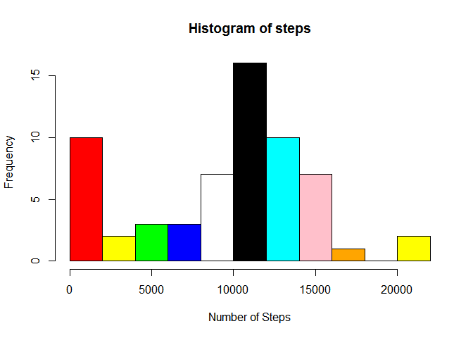
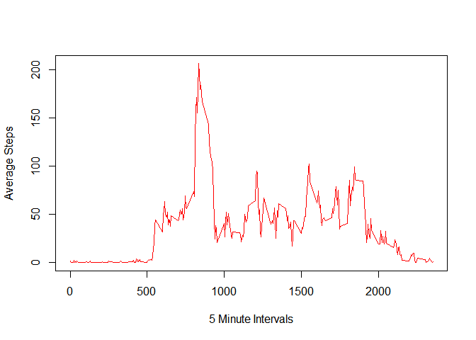
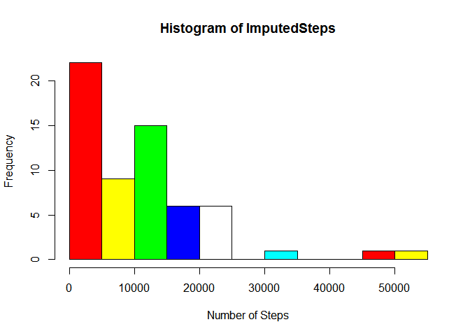

# Reproducible Research: Peer Assessment 1


## Loading and preprocessing the data


```r
activityData <- read.csv("C:/Users/SuitGeek/Desktop/RepData_PeerAssessment1/activity/activity.csv")
dateDownloaded <- date()
dateDownloaded
```

```
## [1] "Sun Jan 18 17:57:17 2015"
```


## What is mean total number of steps taken per day?


```r
activitySteps <- activityData$steps
medianSteps <- median(activitySteps,na.rm="TRUE")
averageSteps <- mean(activitySteps,na.rm="TRUE")
colors = c("red","yellow","green","blue","white","black","cyan","pink","orange")
steps <- tapply(activitySteps,activityData$date,sum,na.rm=TRUE)
hist(steps,breaks=10,col=colors,xlab="Number of Steps")
```

 

## What is the average daily activity pattern?


```r
library(scales)

activityInterval <- activityData$interval
activityMean <- tapply(activitySteps,activityInterval,mean,na.rm=TRUE)
plot(activityInterval[1:288],activityMean,type="l",xlab="5 Minute Intervals",ylab="Average Steps", col="red")
```

 

```r
max <- which.max(activityMean)
max
```

```
## 835 
## 104
```

## Imputing missing values

1. Missing NAs


```r
missingValues <- sum(is.na(activitySteps))
missingValues
```

```
## [1] 2304
```

2. I will be using the mean of the dataset as fillers for the NA values.

3. New Imputed dataset.


```r
steps <- aggregate(steps ~ interval, data = activityData, mean)

activityImputed <- merge(activityData,steps,by="interval")
```

4. Make a histogram of the total number of steps taken each day and Calculate and report the mean and median total number of steps taken per day. Do these values differ from the estimates from the first part of the assignment? What is the impact of imputing missing data on the estimates of the total daily number of steps?


```r
colors = c("red","yellow","green","blue","white","black","cyan","pink","orange")
ImputedSteps <- tapply(activityImputed$steps.y,activityData$date,sum)
hist(ImputedSteps,breaks=10,col=colors,xlab="Number of Steps")
```

 

```r
newMean <- mean(activityImputed$steps.y)
oldMean <- averageSteps

newMean
```

[1] 37.3826

```r
oldMean
```

[1] 37.3826

```r
newMedian <- median(activityImputed$steps.y)
oldMedian <- medianSteps

newMedian
```

[1] 34.11321

```r
oldMedian
```

[1] 0


## Are there differences in activity patterns between weekdays and weekends?


